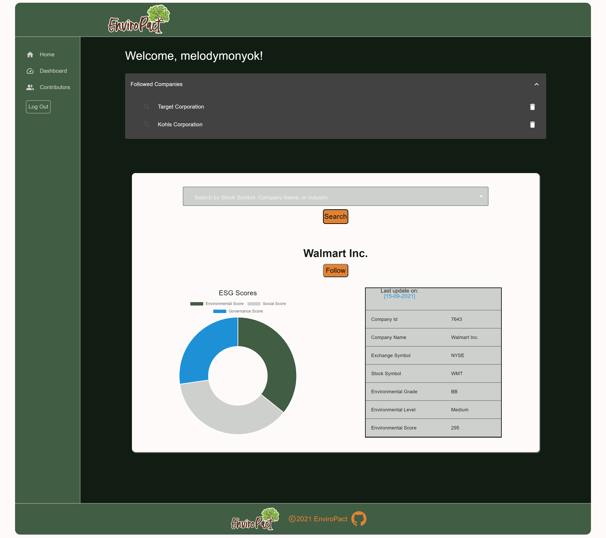

# EnviroPact
Our mission and goal at EnviroPact is to make information and data more accessible and transparent to the public so that together we can work towards creating a world with values.

[Live site!](https://enviropact.herokuapp.com/)

 

## Description
- We care deeply about the environment and holding the corporations that are destroying it accountable.
- The goal of this application is to provide a localized source of information on environmental subject matter in relationto corporations.
- A lot of times data can be complicated and lengthy to read through, so this application aims to make that information accessible and easily understood.
- We strengthened our MERN stack, React App, and Material UI knowledge and skills, as well as learned how to better collaborate with team members.

## Table of Contents
- [EnviroPact](#enviropact)
  - [Description](#description)
  - [Table of Contents](#table-of-contents)
  - [Installation](#installation)
  - [Usage](#usage)
  - [Credits](#credits)
  - [License](#license)
  - [Contributing](#contributing)
  - [Tests](#tests)
  - [Contact](#contact)

## Installation
1. Provided that you have a code editor of your choosing installed on your system, such as VS Code (https://code.visualstudio.com/),

2. Provided that you have a Terminal installed for Windows (https://www.microsoft.com/en-us/p/windows-terminal/9n0dx20hk701?rtc=1&activetab=pivot:overviewtab) or are using a Mac with Terminal installed with the OS,

3. Provided that you have npm and Node.js installed for windows (https://www.npmjs.com/get-npm),

4. Provided you have Git and Github Desktop installed (https://git-scm.com/downloads, https://desktop.github.com/) and have registered for an account,

5. Provided you have MongoDB and Compass installed (https://www.mongodb.com/),

6. Either Clone or Fork this repository: (https://github.com/Justinean/EnviroPact.git),

7. After cloning the repository to your local computer, initialize npm, as well as install needed dependencies.

## Usage
- Without creating an account, you can use the search bar to pull up a company. Just start typing a company name and the drop down options will narrow more as you input more characters into the search bar. Select the one you want and click search.
- When logged in, you are able to access the dashboard, which will provide additional info about the companies you are looking up, as well as allowing you to follow companies. 
- In your followed companies box you can remove companies from being followed, as well as quickly looking up their data by clicking the search icon next to each company name. 

## Credits
- Collaborators
  - [Brian Palay](https://github.com/bpplaysguitar)
  - [Heather Bjoin](https://github.com/HeatMarie)
  - [Justin Hoch](https://github.com/Justinean)
  - [Melody Monyok](https://github.com/mmonyok)

- Technologies Used:
  - [HTML](https://www.w3schools.com/html/)
  - [CSS](https://www.w3schools.com/css/)
  - [JavaScript](https://www.w3schools.com/js/)
  - [FontAwesome](https://fontawesome.com/)
  - [Google Fonts](https://fonts.google.com/)
  - [ScreenToGIF](https://www.screentogif.com/)
  - [The Following Node Packages:](https://www.npmjs.com/get-npm)
    - Client-Side:
      - @apollo/client
      - @emotion/react
      - @emotion/styled
      - @material-ui/core
      - @material-ui/icons
      - @mui/icons-material
      - @mui/material
      - @mui/styles
      - @testing-library/jest-dom
      - @testing-library/react
      - @testing-library/user-event
      - chart.js
      - dotenv
      - graphql
      - jwt-decode
      - react
      - react-chartjs-2
      - react-dom
      - react-router
      - react-router-dom
      - react-scripts
      - web-vitals
    - Server-Side:
      - apollo-server-express
      - bcrypt
      - dotenv
      - express
      - graphql
      - jsonwebtoken
      - mongoose

- Tutorials Followed:
[Professional README guide template provided by Coding Boot Camp.](https://github.com/coding-boot-camp)

## License
MIT License

Copyright (c) [2021] [Brian Palay, Heather Bjoin, Justin Hoch, & Melody Monyok]

Permission is hereby granted, free of charge, to any person obtaining a copy
of this software and associated documentation files (the "Software"), to deal
in the Software without restriction, including without limitation the rights
to use, copy, modify, merge, publish, distribute, sublicense, and/or sell
copies of the Software, and to permit persons to whom the Software is
furnished to do so, subject to the following conditions:

The above copyright notice and this permission notice shall be included in all
copies or substantial portions of the Software.

THE SOFTWARE IS PROVIDED "AS IS", WITHOUT WARRANTY OF ANY KIND, EXPRESS OR
IMPLIED, INCLUDING BUT NOT LIMITED TO THE WARRANTIES OF MERCHANTABILITY,
FITNESS FOR A PARTICULAR PURPOSE AND NONINFRINGEMENT. IN NO EVENT SHALL THE
AUTHORS OR COPYRIGHT HOLDERS BE LIABLE FOR ANY CLAIM, DAMAGES OR OTHER
LIABILITY, WHETHER IN AN ACTION OF CONTRACT, TORT OR OTHERWISE, ARISING FROM,
OUT OF OR IN CONNECTION WITH THE SOFTWARE OR THE USE OR OTHER DEALINGS IN THE
SOFTWARE.

## Contributing
- Please submit any contributions you think will improve this project.

## Tests
- No further testing is needed, unless any new contributions are made; the owner of this project will locally test any contribution submissions prior to approval.

## Contact
- Brian Palay
  - <brianpalay@gmail.com>
- Heather Bjoin
  - <h.m.bjoin@gmail.com>
- Justin Hoch
  - <justinonlycoding@gmail.com>
- Melody Monyok
  - <monyokwebdev@gmail.com>